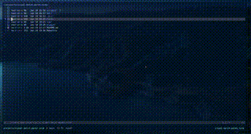
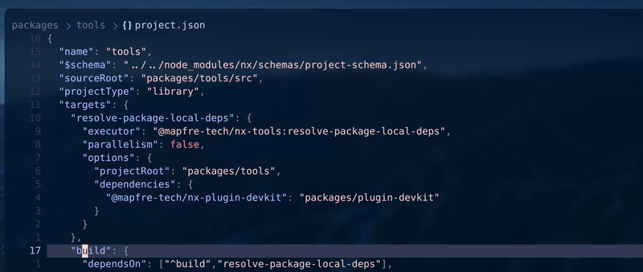

# visual-match-paren.nvim

A Neovim plugin that highlights matching pairs of braces `{}` and brackets `[]` when you visually select lines containing them. Additionally, it can highlight the scope (via line numbers) of any selected line using treesitter.

## Demo

### Brace/Bracket Matching


### Scope Highlighting & Text Object


## Features

- Automatically highlights matching pairs for braces `{}` and brackets `[]`
- Supports forward matching: select a line ending with `{` or `[` to highlight the closing pair
- Supports backward matching: select a line starting with `}` or `]` to highlight the opening pair
- **NEW:** Highlights the scope of any visually selected line using treesitter (line numbers only)
- **NEW:** Text object for selecting inner scope (`I` by default)
- **NEW:** Incremental/decremental node selection using treesitter (`<Tab>`/`<S-Tab>` by default)
- Works in visual, visual-line, and visual-block modes
- Customizable highlight groups
- Lightweight and performant

## Installation

### Using [lazy.nvim](https://github.com/folke/lazy.nvim)

```lua
{
  "jugarpeupv/visual-match-paren.nvim",
  config = function()
    require("visual-match-paren").setup({
      -- Optional configuration
      highlight_group = "MatchParen",       -- Highlight group for braces/brackets (default: "MatchParen")
      scope_highlight_group = "MatchParen", -- Highlight group for scope line numbers (default: "MatchParen")
      enabled = true,                       -- Enable/disable brace/bracket matching (default: true)
      scope_enabled = true,                 -- Enable/disable scope highlighting (default: true)
      scope_textobject = "I",               -- Text object for inner scope (default: "I", set to "" to disable)
      incremental_selection = {
        enabled = true,                     -- Enable/disable incremental selection (default: true)
        keymaps = {
          increment = "<Tab>",              -- Key to increment node selection (default: "<Tab>")
          decrement = "<S-Tab>",            -- Key to decrement node selection (default: "<S-Tab>")
        },
      },
    })
  end,
}
```

### Using [packer.nvim](https://github.com/wbthomason/packer.nvim)

```lua
use {
  "jugarpeupv/visual-match-paren.nvim",
  config = function()
    require("visual-match-paren").setup()
  end,
}
```

## Usage

### Brace/Bracket Matching

Simply enter visual mode and select a line that:
- Ends with `{` or `[` - highlights the matching closing pair
- Starts with `}` or `]` - highlights the matching opening pair

#### Example

```json
{
  "foo": {
    "bar": "bazz"
  }
}
```

When you visually select the line `"foo": {`, the closing `}` on line 4 will be highlighted.

The plugin also works with brackets:

```javascript
const arr = [
  1, 2, 3
]
```

When you select the line `const arr = [`, the closing `]` will be highlighted. Similarly, selecting a line with the closing bracket will highlight its matching opening bracket.

### Scope Highlighting

When you visually select any line, the plugin uses treesitter to detect the scope and highlights the **line numbers** of all lines within that scope. This is non-intrusive as it only affects the line number column, not the text itself.

#### Example

```yaml
- Microfrontends:
    - Visión general: docs/overview.md
    - Arquitectura: docs/architecture.md
    - Configuration:
        - Setup: docs/setup.md
        - Advanced: docs/advanced.md
```

When you select the line `- Microfrontends:`, the line numbers for all nested items will be highlighted, making it easy to see the scope of that section.

### Scope Text Object

Use the `I` text object (configurable) to quickly select the inner scope:

- **From normal mode**: `VI` - Enter visual line mode and select inner scope
- **From visual mode**: `I` - Expand selection to inner scope
- **Toggle back**: Press `I` again in visual mode to restore your previous selection
- **With operators**: `dI` - Delete inner scope, `yI` - Yank inner scope

#### Behavior

1. **Inner scope first**: If the line has nested content, selects that content
2. **Fallback to parent**: If no inner content (e.g., a leaf node like `- Configuración librerías compartidas:`), selects the parent scope
3. **Toggle feature**: Press `I` again to restore your previous selection (useful if you want to go back to your original selection)

#### Example

Position your cursor on `- Microfrontends:` and press `VI` to select all nested lines under it. Position on a leaf item and press `VI` to select its parent scope.

**Toggle example:**
1. Select a single line with `V`
2. Press `I` → expands to scope
3. Press `I` again → returns to your original single line selection

### Incremental/Decremental Node Selection

Use `<Tab>` and `<S-Tab>` (configurable) to incrementally expand or shrink your visual selection based on treesitter syntax nodes:

- **Increment selection (`<Tab>`)**: Expand the current visual selection to the parent syntax node
- **Decrement selection (`<S-Tab>`)**: Shrink the selection back to the previous node

#### How to use

1. Enter visual mode (e.g., `V` for line-wise, or `v` for character-wise)
2. Optionally use the `I` text object to select a scope
3. Press `<Tab>` to expand selection to the parent node
4. Press `<Tab>` again to continue expanding to larger parent nodes
5. Press `<S-Tab>` to shrink back to the previous selection

#### Example workflow

```lua
function hello()
  local x = 1
  if x > 0 then
    print("positive")
  end
end
```

1. Position cursor on `print("positive")` and press `V` to select the line
2. Press `<Tab>` → expands to the if block
3. Press `<Tab>` → expands to the function body
4. Press `<Tab>` → expands to the entire function
5. Press `<S-Tab>` → shrinks back to the function body
6. Press `<S-Tab>` → shrinks back to the if block

This feature is powered by treesitter and works with any language that has a treesitter parser installed.

## Commands

- `:VisualMatchParenToggle` - Toggle the plugin on/off

## Configuration

The plugin can be configured with the following options:

```lua
require("visual-match-paren").setup({
  highlight_group = "MatchParen",       -- The highlight group for braces/brackets
  scope_highlight_group = "MatchParen", -- The highlight group for scope line numbers
  enabled = true,                       -- Enable brace/bracket matching by default
  scope_enabled = true,                 -- Enable scope highlighting by default
  scope_textobject = "I",               -- Text object for inner scope (set to "" to disable)
  incremental_selection = {
    enabled = true,                     -- Enable incremental selection feature
    keymaps = {
      increment = "<Tab>",              -- Key to increment node selection
      decrement = "<S-Tab>",            -- Key to decrement node selection
    },
  },
})
```

You can customize the scope highlight to be more subtle if desired:

```lua
-- Create a custom highlight group for scope
vim.api.nvim_set_hl(0, "ScopeHighlight", { fg = "#6c7086", italic = true })

require("visual-match-paren").setup({
  scope_highlight_group = "ScopeHighlight", -- Use custom highlight for scope
})
```

To use a different key for the text object:

```lua
require("visual-match-paren").setup({
  scope_textobject = "S", -- Use 'S' instead of 'I'
  -- or set to "" to disable the text object mapping
})
```

To customize the incremental selection keymaps or disable the feature:

```lua
require("visual-match-paren").setup({
  incremental_selection = {
    enabled = true,  -- Set to false to disable the feature
    keymaps = {
      increment = "<C-n>",  -- Use Ctrl+n to increment
      decrement = "<C-p>",  -- Use Ctrl+p to decrement
    },
  },
})
```

## How it works

The plugin listens for mode changes and cursor movements in visual mode. When you're in visual mode, it:

### Brace/Bracket Matching

1. Detects if the selected line ends with `{` or `[`, or starts with `}` or `]`
2. Positions the cursor on the opening or closing character
3. Uses Neovim's built-in `searchpairpos` to find the matching pair
4. Highlights both the selected and matching character using the specified highlight group

This ensures that nested structures are matched correctly, even in deeply nested JSON, JavaScript, or other brace/bracket-based languages.

### Scope Highlighting

1. Uses treesitter to get the syntax node at the selected line
2. Gets the parent node to determine the scope
3. Highlights the line numbers (using `number_hl_group` extmark option) for all lines within that scope
4. Only highlights if the scope is meaningful (more than just the current line)

This feature requires treesitter to be installed and a parser available for the current filetype.

### Incremental/Decremental Selection

1. When you press the increment key (default `<Tab>`) in visual mode:
   - Gets the treesitter node at the current selection
   - Finds the parent node and expands the selection to match it
   - Saves the previous selection to a stack for decrementing
2. When you press the decrement key (default `<S-Tab>`):
   - Pops the previous selection from the stack
   - Restores that selection

This allows you to navigate the syntax tree structure of your code naturally, expanding and shrinking selections based on the actual syntax nodes.

## Testing

See [tests/README.md](tests/README.md) for information about running tests.

```bash
make test
```

## License

MIT
