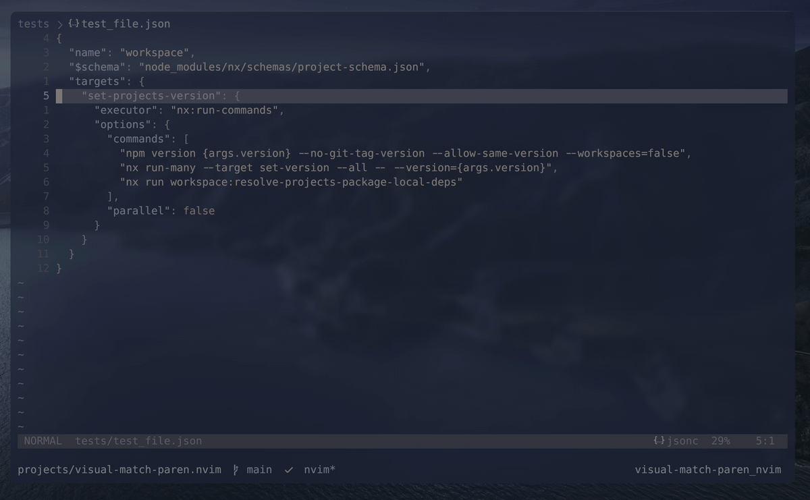

# visual-match-paren.nvim

A Neovim plugin that highlights matching pairs of braces `{}` and brackets `[]` when you visually select lines containing them.

## Demo



## Features

- Automatically highlights matching pairs for braces `{}` and brackets `[]`
- Supports forward matching: select a line ending with `{` or `[` to highlight the closing pair
- Supports backward matching: select a line starting with `}` or `]` to highlight the opening pair
- Works in visual, visual-line, and visual-block modes
- Customizable highlight group
- Lightweight and performant

## Installation

### Using [lazy.nvim](https://github.com/folke/lazy.nvim)

```lua
{
  "jugarpeupv/visual-match-paren.nvim",
  config = function()
    require("visual-match-paren").setup({
      -- Optional configuration
      highlight_group = "MatchParen", -- Highlight group to use (default: "MatchParen")
      enabled = true,                 -- Enable/disable the plugin (default: true)
    })
  end,
}
```

### Using [packer.nvim](https://github.com/wbthomason/packer.nvim)

```lua
use {
  "jugarpeupv/visual-match-paren.nvim",
  config = function()
    require("visual-match-paren").setup()
  end,
}
```

## Usage

Simply enter visual mode and select a line that:
- Ends with `{` or `[` - highlights the matching closing pair
- Starts with `}` or `]` - highlights the matching opening pair

### Example

```json
{
  "foo": {
    "bar": "bazz"
  }
}
```

When you visually select the line `"foo": {`, the closing `}` on line 4 will be highlighted.

The plugin also works with brackets:

```javascript
const arr = [
  1, 2, 3
]
```

When you select the line `const arr = [`, the closing `]` will be highlighted. Similarly, selecting a line with the closing bracket will highlight its matching opening bracket.

## Commands

- `:VisualMatchParenToggle` - Toggle the plugin on/off

## Configuration

The plugin can be configured with the following options:

```lua
require("visual-match-paren").setup({
  highlight_group = "MatchParen", -- The highlight group to use
  enabled = true,                 -- Enable the plugin by default
})
```

## How it works

The plugin listens for mode changes and cursor movements in visual mode. When you're in visual mode, it:

1. Detects if the selected line ends with `{` or `[`, or starts with `}` or `]`
2. Positions the cursor on the opening or closing character
3. Uses Neovim's built-in `searchpairpos` to find the matching pair
4. Highlights both the selected and matching character using the specified highlight group

This ensures that nested structures are matched correctly, even in deeply nested JSON, JavaScript, or other brace/bracket-based languages.

## Testing

See [tests/README.md](tests/README.md) for information about running tests.

```bash
make test
```

## License

MIT
